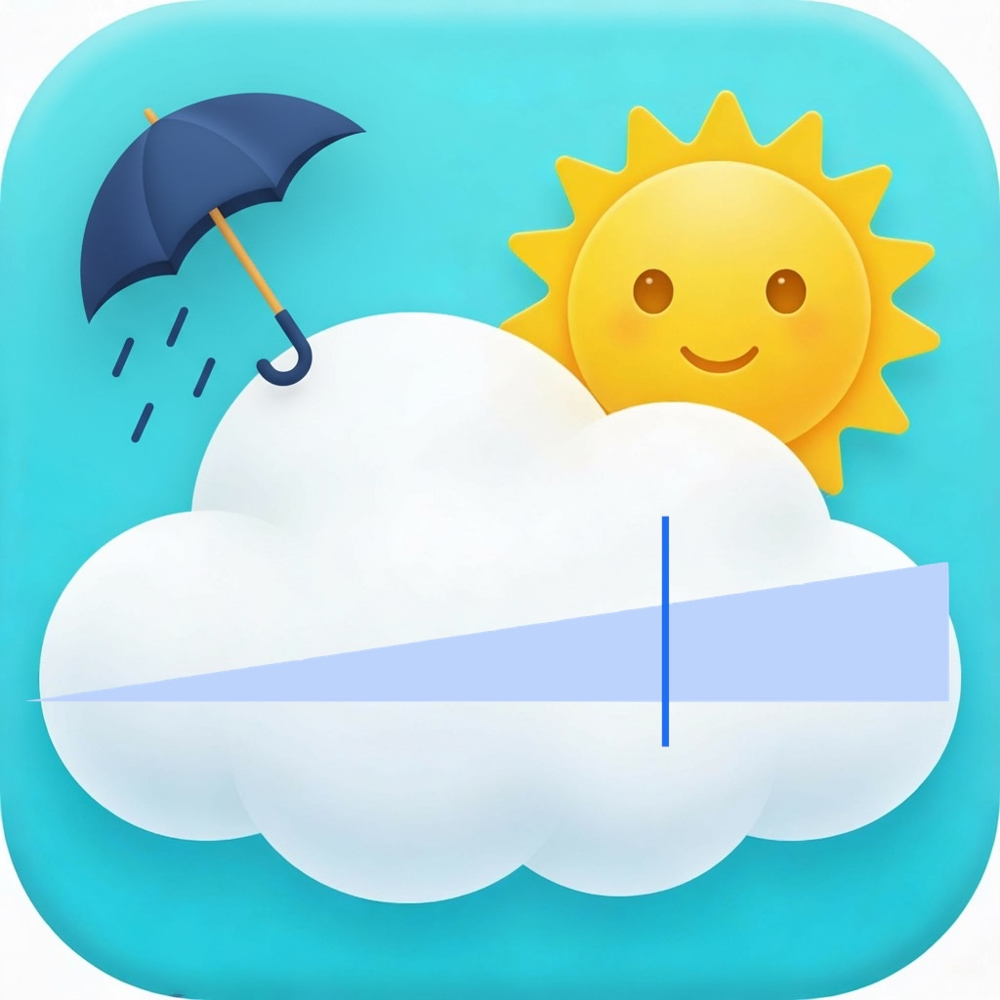
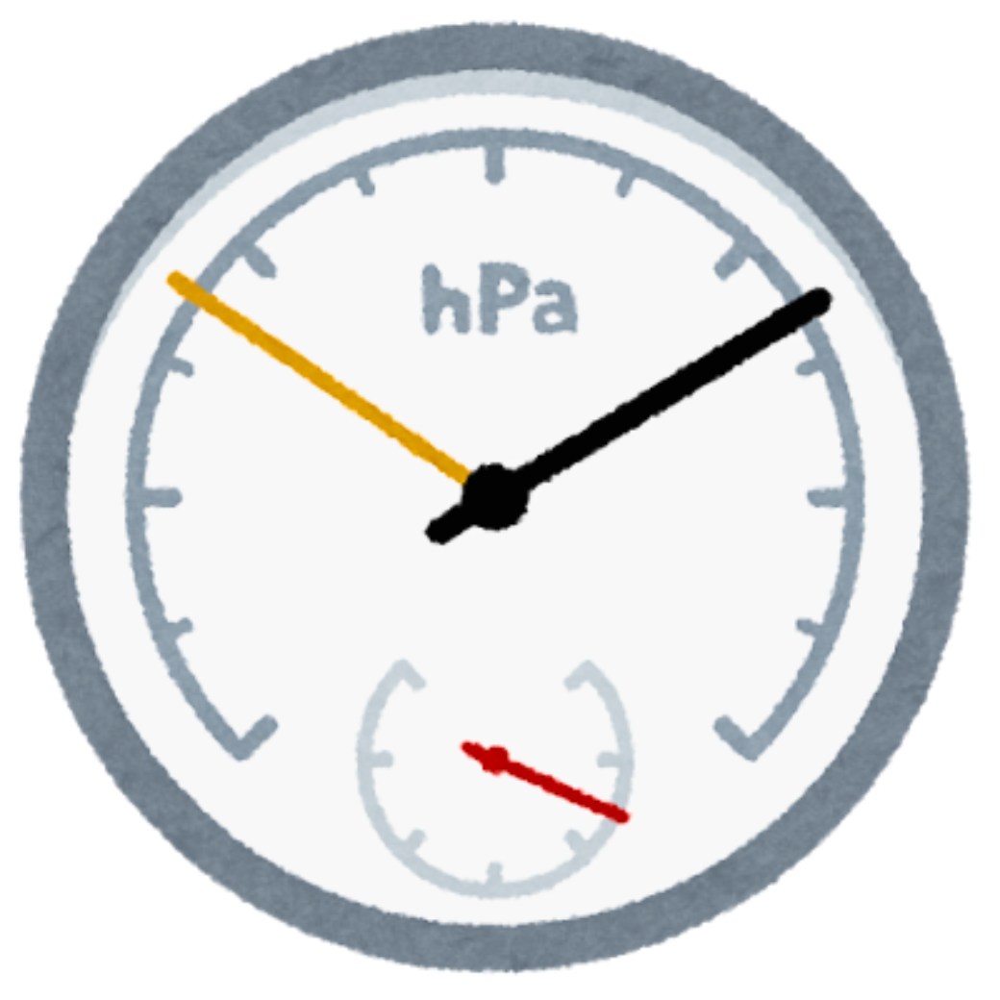

# iPad VAS Env Monitor / Baro Gage

-   目的: iPad / iPhone の内蔵気圧計と外部センサーを用いて、5分毎の気圧・室温・湿度を記録し、VAS イベントも併記する。
-   ローカル環境: MacBook Pro M4 16インチ, RStudio, Xcode.
-   構成:
    -   R: データ管理・前処理・解析・図の作成
    -   iOSアプリ: 気圧（＋高度）連続計測、5分毎のログ保存、VAS スライダー UI（将来予定）

## プロジェクト構成

``` text
Home
├── README.md # このファイル
├── ipad_VAS_env_monitor.Rproj # R プロジェクト
├── R_Script # 解析用 R スクリプト
│ └── mock_data_and_plot.R # ダミーデータ生成とプロット
├── data
│ ├── raw/ # 生データ（iOS ログなど）※今後作成
│ └── processed/ # 前処理済みデータ
├── Output
│ └── Figures
│ ├── scatter_pressure_vs_vas_2025-01-01.png
│ └── timeseries_pressure_vas_2025-01-01.png
├── docs
│ ├── VAS_slider_spec.md # iPad VAS スライダー仕様
│ └── data_spec.md # データ仕様・変数の説明
└── ios_app # iOS / iPadOS アプリ関連
├── App_icon # アプリ用アイコン画像
│ ├── PressureVAS.JPG
│ ├── air_pressure_gage.png
│ ├── iPhone_VAS_Slider1.png
│ └── iPhone_VAS_Slider2.png
├── PressureManager # Baro Gage（気圧計測アプリ）
│ ├── BarotestApp.swift
│ ├── ContentView.swift
│ ├── BaroGraphView.swift
│ ├── PressureManager.swift
│ └── Assets.xcassets / Barotest.xcodeproj など
├── PressureDemo # 旧デモ用プロジェクト
└── PressureVAS # VAS と気圧を組み合わせたアプリ案
├── PressureVASApp.swift
└── ContentView.swift
```

## iOS アプリ（BaroGage / VAS Scale）の役割

### PressureVAS（`ios_app/PressureVAS`）

<div style="display:flex; align-items:flex-start; gap:12px;">
  
  <div>
    VAS スライダー UI と気圧データの統合を将来実装予定。
  </div>
</div>


### Baro Gage（`ios_app/PressureManager`）

<div style="display:flex; align-items:flex-start; gap:12px;">
  
  <div>
    Phone 15 などの気圧センサーから現在の気圧・高度を取得し<br>
    10秒ごとのグラフ表示と5分毎のログ保存を行う。<br>
    急激な気圧変化の検出と画面フラッシュ・強調表示（実装中）
  </div>
</div>

------------------------------------------------------------------------

## 今後の予定

-   R 側
    -   5分値ログ（気圧・温度・湿度・VAS）のデータ形式を確定する
    -   時系列プロット・相関解析のスクリプト整備
-   iOS 側
    -   Baro Gage のバックグラウンド 5分毎ログの安定化
    -   気圧急変アラート（フラッシュ＋赤丸）の実装
    -   VAS スライダーを組み合わせた iPad 用 UI の実装
